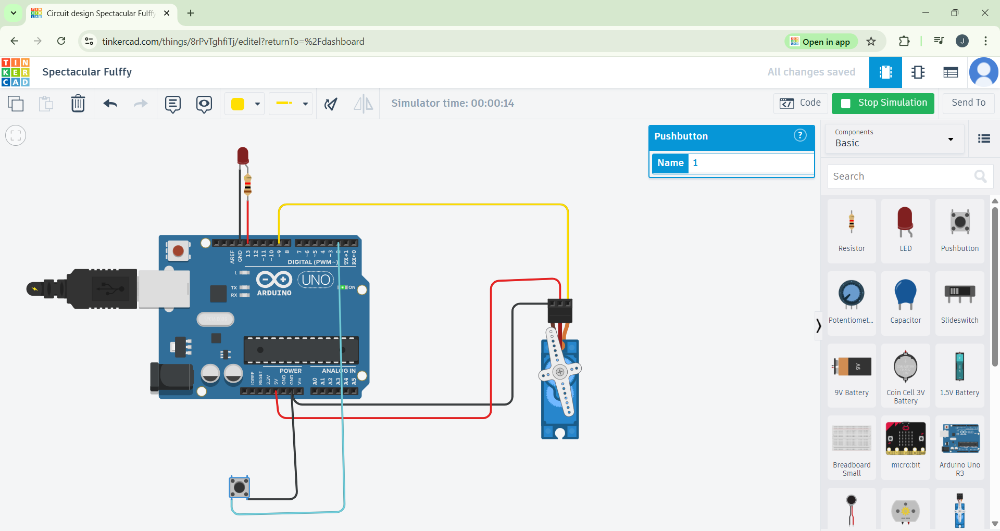

# Automatic Door Lock System

## Description
Fingerprint based automatic door lock using Arduino.

## Components
- Arduino UNO
- Servo Motor
- Fingerprint Sensor
- Jumper wires

## Circuit Diagram

## Simulation
https://www.tinkercad.com/things/8rPvTghfiTj-automatic-door-lock-system?sharecode=cCnWHlnRc4JFGDa0Nr0-CpZfUm6XgH034_N23OUdl6o
